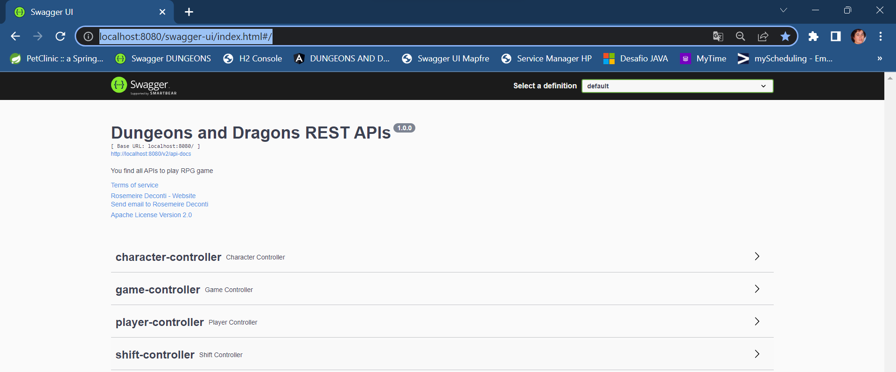

# APPLICATION: RPG GAME DUNGEONS AND DRAGONS
Avanade Challenge Spring Boot to Create REST APIs to play the game

# TODO LIST
- code LOGIN/LOGOUT to define PLAYER
- code FIRST PAGE
- code DICE options
- code languages EN, ES and PT
- review all TESTS to BACKEND
- review all TESTS to FRONTEND
- draw DATABASE schema
- use POSTGRES instead of H2 database (without use DOCKER! How to?)

# RPG GAME DESCRIPTION
- all description available in PDF file "desafio-avanade-rpg"

# APIS AVAILABLE IN SWAGGER
Access http://localhost:8080/swagger-ui/index.html#/

## Checklist Swagger
| Table/Apis | Create | Read | Update | Delete | List |
|------------|--------|------|--------|--------|------|
| characters | ok     | ok   | ok     | ok     | ok   |
| games      | ok     | ok   | ok     | ok     | ok   |
| players    | ok     | ok   | ok     | ok     | ok   |       
| shifts     | ok     | ok   | ok     | ok     | ok   |

# H2 DATABASE CONSOLE
Access http://localhost:8080/h2-console/login.jsp?jsessionid=83f57129448a6e3853d0ad4bffaf53bb

## Checklist H2 DATABASE
| Table      | Initialization | Select * |
|------------|----------------|----------|
| characters | ok             | ok       |
| games      | ok             | ok       |
| players    | ok             | ok       |
| shifts     | ok             | ok       |

# BACKEND
IT WAS DEVELOPED CONTROLLER, MODEL, REPOSITORY AND SERVICES TO 
TREAT CRUD TO:
- CHARACTER
- GAME
- PLAYER
- SHIFT

# FRONTEND

- HOME PAGE
- MENU BAR WITH CRUD TO TREAT: PLAYER, GAME, CHARACTER AND SHIFTS
- GAME FLOW TO BE FLOWED BY PLAYER IN EACH STEP CARD
- RESET BUTTON CREATE A NEW GAME TO PLAYER

- LISTS TO EACH COMPONENT LIKE CHARACTER LIST

- LISTS TO EACH COMPONENT LIKE PLAYER LIST

- ALERT MESSAGES INTERACTING WITH PLAYER

- MONITOR GAME WITH A RESUME ABOUT SHIFT / LIFE POINTS

